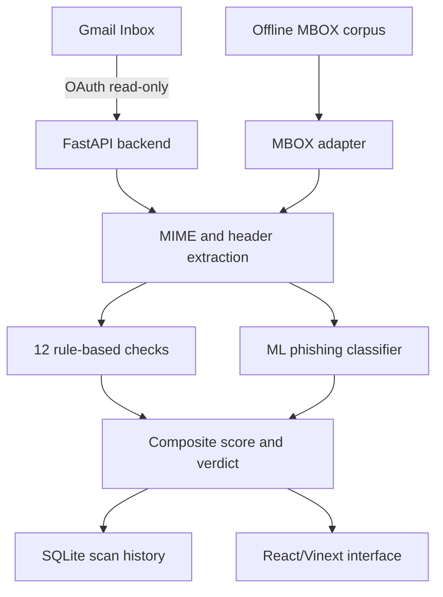

# PhishGuard DFIR — Codebase and Repository Structure

PhishGuard is an AI-assisted phishing email analysis and DFIR prototype. It
connects to a test Gmail inbox through read-only OAuth, extracts message
evidence, runs 12 explainable forensic/content rules plus one machine-learning
classifier, assigns a composite risk score, and stores completed analyses so
emails do not need to be rescanned after every refresh.

The repository also contains offline MBOX processing, model-training and
validation utilities, safe phishing-simulation samples, security guidance and
the hackathon design documentation.

## Current version

- Backend: **v2.4**
- Frontend: React/Vinext
- Local backend: FastAPI on `http://127.0.0.1:8000`
- Local frontend: `http://localhost:5173`
- Gmail permission: `gmail.readonly`
- Scan history: local SQLite
- ML model: TF-IDF and logistic-regression pipeline stored with Joblib

## Architecture



## Repository structure

```text
forensic-frontiers-hackathon/
├── README.md
│   └── Existing hackathon overview and project documentation
│
├── PHISHGUARD_VSCODE_SETUP.md
│   └── Detailed instructions for running the complete application in VS Code
│
├── PHISHGUARD_CODEBASE_README.md
│   └── This codebase and repository-structure guide
│
├── SECURITY.md
│   └── OAuth, privacy, local API, dataset, malware and production risks
│
├── .gitignore
│   └── Prevents credentials, tokens, databases, environments and build output
│       from being committed
│
├── backend/
│   ├── api.py
│   │   ├── FastAPI application and Gmail connector
│   │   ├── Complete-Inbox pagination
│   │   ├── MIME, text, HTML, header and attachment-name extraction
│   │   ├── Twelve rule-based security checks
│   │   ├── Machine-learning inference as the thirteenth check
│   │   ├── Composite risk scoring
│   │   ├── SQLite scan-history persistence
│   │   └── Cached analysis and forced-rerun behavior
│   │
│   ├── authorize_gmail.py
│   │   └── Opens the Google OAuth browser flow and creates a read-only
│   │       `token.json`
│   │
│   ├── train_model.py
│   │   ├── Reads labelled email CSV files
│   │   ├── Converts labels to legitimate/phishing classes
│   │   ├── Trains TF-IDF plus logistic regression
│   │   ├── Prints a test classification report
│   │   └── Saves `models/phishing_model.joblib`
│   │
│   ├── validate_model.py
│   │   ├── Loads the independent controlled validation samples
│   │   ├── Calculates accuracy, precision, recall and F1
│   │   ├── Produces a confusion matrix
│   │   └── Writes detailed incorrect-prediction results
│   │
│   ├── analyze_mbox.py
│   │   ├── Safely parses raw MBOX/MIME messages
│   │   ├── Converts them to the Gmail-style internal structure
│   │   ├── Reuses the same `analyse_message()` pipeline
│   │   └── Produces CSV summary and JSONL evidence files
│   │
│   ├── requirements.txt
│   │   └── Python dependencies for FastAPI, Gmail OAuth, ML and validation
│   │
│   ├── models/
│   │   ├── README.md
│   │   └── phishing_model.joblib        # Local only; ignored by Git
│   │
│   ├── validation_data/
│   │   └── phishguard_sample_emails.csv # 25 legitimate + 25 phishing samples
│   │
│   ├── credentials.json                 # Local OAuth client; ignored by Git
│   ├── token.json                       # Local Gmail token; ignored by Git
│   ├── scan_history.db                  # Runtime SQLite DB; ignored by Git
│   └── venv/                            # Python environment; ignored by Git
│
├── frontend/
│   ├── app/
│   │   ├── page.tsx
│   │   │   ├── Inbox module
│   │   │   ├── Email Analysis module
│   │   │   ├── Malware Analyser module
│   │   │   ├── Risk Assessment module
│   │   │   ├── Reports module
│   │   │   ├── Gmail connection and refresh logic
│   │   │   ├── Backend analysis calls
│   │   │   └── Report export behavior
│   │   │
│   │   ├── globals.css
│   │   │   └── Complete responsive visual design, colours, layouts,
│   │   │       animations and security-status styling
│   │   │
│   │   ├── layout.tsx
│   │   │   └── Root application layout and metadata
│   │   │
│   │   └── chatgpt-auth.ts
│   │       └── Optional hosted-site identity helpers; not required by the
│   │           local Gmail analysis workflow
│   │
│   ├── components/ui/
│   │   ├── button.tsx, badge.tsx, card.tsx, dialog.tsx
│   │   ├── progress.tsx, table.tsx, tabs.tsx, tooltip.tsx
│   │   ├── sidebar.tsx, sheet.tsx, select.tsx, scroll-area.tsx
│   │   └── Additional reusable interface primitives
│   │
│   ├── hooks/
│   │   └── use-mobile.ts                # Responsive/mobile state helper
│   │
│   ├── lib/
│   │   └── utils.ts                     # Shared class and UI utilities
│   │
│   ├── public/
│   │   ├── favicon.svg
│   │   └── Supporting public SVG assets
│   │
│   ├── db/
│   │   ├── index.ts
│   │   └── schema.ts                    # Optional hosted database scaffold
│   │
│   ├── build/
│   │   └── sites-vite-plugin.ts         # Hosted-site/Vite integration
│   │
│   ├── scripts/
│   │   ├── run-framework.mjs
│   │   ├── execution-profile.mjs
│   │   ├── sites-env.mjs
│   │   └── Dependency/build helper scripts
│   │
│   ├── vendor/
│   │   └── Shadcn/Tailwind stylesheet and licence
│   │
│   ├── .openai/hosting.json             # Local/hosted Sites configuration
│   ├── components.json                  # UI component configuration
│   ├── cloudflare-env.d.ts              # Hosted runtime type declarations
│   ├── drizzle.config.ts                # Optional DB migration configuration
│   ├── eslint.config.mjs                # Linting configuration
│   ├── next.config.ts                   # Next/Vinext configuration
│   ├── postcss.config.mjs               # CSS processing configuration
│   ├── tsconfig.json                    # TypeScript configuration
│   ├── vite.config.ts                   # Vite/Vinext development configuration
│   ├── package.json                     # Frontend packages and commands
│   ├── package-lock.json                # npm dependency lock generated locally
│   ├── pnpm-lock.yaml                   # Original pnpm dependency lock
│   └── node_modules/                    # Installed packages; ignored by Git
│
├── tools/
│   └── gmail_phishing_test_pack.csv
│       ├── Safe simulated phishing scenarios
│       ├── Reserved `example.com` URLs
│       └── Legitimate control messages
│
├── Module1_2_Enhancements_Addendum.docx
├── Phishing_Forensics_Hackathon_Framework.docx
├── Unified_DFIR_Framework.docx
└── PhishGuard DFIR — Complete Development Workflow and Change Record
    └── Existing hackathon design, framework and development documentation
```

Files marked **local only** are intentionally absent from GitHub. They must be
created or supplied by each authorized user.

## Backend API

| Method | Route | Purpose |
|---|---|---|
| `GET` | `/` | Health, backend version, model state and capabilities |
| `GET` | `/api/messages` | Loads all messages carrying Gmail's `INBOX` label and attaches saved scan summaries |
| `GET` | `/api/messages/{message_id}/analysis` | Returns cached analysis or runs a new analysis |
| `GET` | `/api/messages/{message_id}/analysis?force=true` | Forces a rescan and replaces the saved result |

## Detection checks

PhishGuard currently returns 13 explainable checks:

1. SPF Verification
2. DKIM Verification
3. DMARC Alignment
4. Header Address Consistency
5. Sender Route & IP
6. Sender Domain Safety
7. Machine-Learning Classification
8. URL & Redirect Indicators
9. Urgency & Pressure Language
10. Sensitive-Data Request
11. Attachment Type Safety
12. Hidden HTML Content
13. Message-ID Structure

## Risk calculation

Machine-learning contribution:

| Phishing probability | Points |
|---|---:|
| 85% or higher | 50 |
| 60%–84.99% | 25 |
| 40%–59.99% | 10 |
| Below 40% | 0 |

Final verdict thresholds:

| Score | Verdict | Severity |
|---|---|---|
| 80–100 | Malicious | Critical |
| 50–79 | Malicious | High |
| 20–49 | Suspicious | Medium |
| 0–19 | Low risk | Safe |

## Local setup

### Prerequisites

- Python 3.11 or newer
- Node.js 22.13 or newer
- npm
- Google Cloud project with Gmail API enabled
- OAuth Desktop client downloaded as `credentials.json`
- Test Gmail account added to the OAuth consent screen

### Backend

```powershell
cd backend
python -m venv venv
venv\Scripts\activate
python -m pip install -r requirements.txt
python authorize_gmail.py
python -m uvicorn api:app --reload --port 8000
```

If Windows Application Control blocks Uvicorn's executable launcher, use the
`python -m uvicorn` form shown above. If reload is blocked, run:

```powershell
python -m uvicorn api:app --port 8000
```

Verify at <http://127.0.0.1:8000>.

### Frontend

Open a second terminal:

```powershell
cd frontend
npm install
npm run dev
```

Open <http://localhost:5173>.

## Application workflow

1. The frontend calls `/api/messages`.
2. The backend follows all Gmail `nextPageToken` values and loads the complete
   Inbox.
3. Saved SQLite results are attached to previously scanned Gmail IDs.
4. Unseen messages display `PENDING`.
5. Selecting an email calls its analysis endpoint.
6. The backend extracts MIME/header/content evidence.
7. Twelve rules and the ML model run.
8. Scores are combined and capped at 100.
9. The result is saved to `scan_history.db`.
10. Refreshing the Inbox retains the saved score and verdict.
11. **Run again** uses `force=true` to replace the cached result.

## Validation and evidence

Controlled independent sample results:

| Metric | Result |
|---|---:|
| Samples | 50 |
| Accuracy | 86.00% |
| Precision | 87.50% |
| Recall | 84.00% |
| F1 | 85.71% |

Nazario MBOX pipeline stress test:

| Result | Count |
|---|---:|
| Successfully analysed | 2,274 |
| Malicious | 1,049 |
| Suspicious | 1,006 |
| Low risk | 219 |
| Parsing errors | 5 |
| Detection coverage | 90.37% |
| Processing success | 99.78% |

The Nazario result is **corpus detection coverage**, not independent model
accuracy, because Nazario-derived content contributed to model development.

## Git safety

The following must never be committed:

```text
backend/credentials.json
backend/token.json
backend/sender_token.json
backend/scan_history.db
backend/models/phishing_model.joblib
backend/venv/
frontend/node_modules/
offline_data/
offline_results/
```

Before pushing, verify:

```powershell
git ls-files |
Select-String "credentials.json|token.json|sender_token.json|scan_history.db|phishing_model.joblib|node_modules|backend/venv"
```

The command should produce no output.

## Prototype limitations

- The score is analyst decision support, not proof of maliciousness.
- Gmail authentication can pass for phishing sent from a legitimate or
  compromised account.
- Attachments are identified by metadata and filename but are not downloaded or
  executed.
- YARA, hash reputation and sandbox detonation are represented in the UI but
  are not connected to the current backend.
- Domain age, threat-intelligence enrichment and redirect traversal are not yet
  implemented.
- The local backend has no user authentication and must remain bound to
  `127.0.0.1`.
- Large Inbox retrievals may take time and consume Gmail API quota.

## Safe project description

> PhishGuard is an explainable phishing-analysis and DFIR prototype combining
> live read-only Gmail ingestion, twelve forensic/content rules, a text
> classifier, persistent scan history and offline MBOX processing. It is an
> AI-assisted hackathon implementation and is not a production email-security
> gateway.
